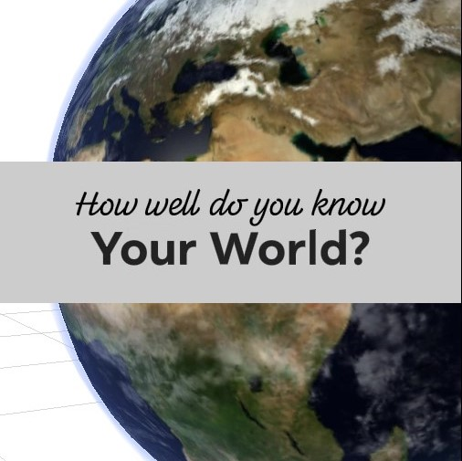
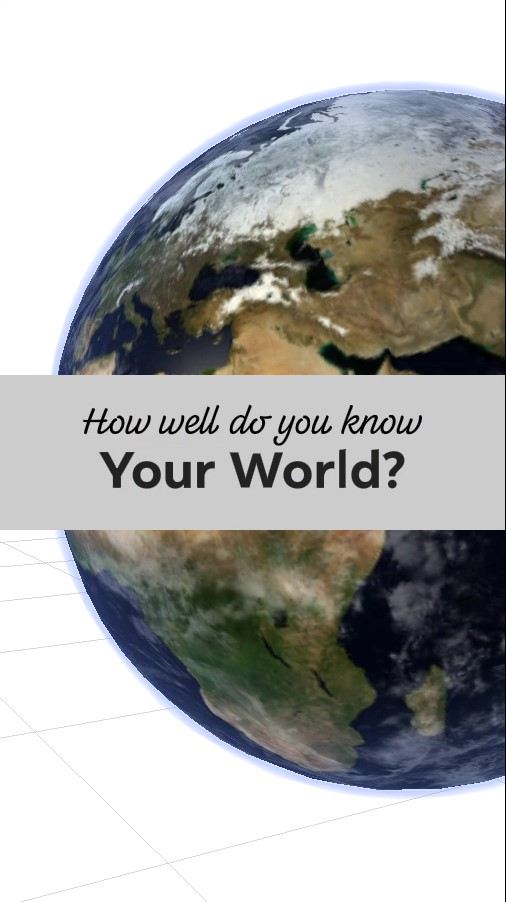
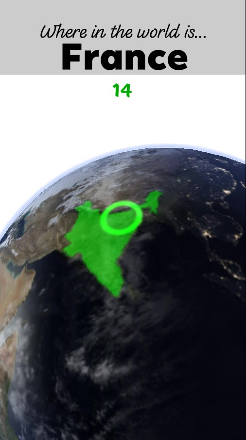
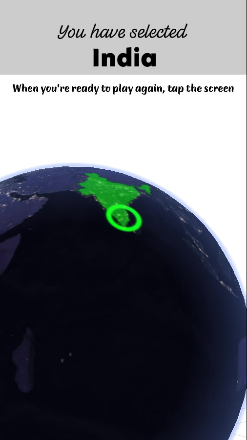

# How Well Do You Know Your World

The world is your game board! Run around a beautifully rendered planet Earth. Aim at countries you're challenged to identify. Do it all before the clock runs out to prove how well you know your world!

Try it out: [Facebook Test Link](https://www.facebook.com/fbcameraeffects/testit/2883742358415652/MDNhMjI5NDBmYjY3Yzg3OTFmMTM0MmQ1NmE1NTI2N2M=/), [Instagram Test Link](https://www.instagram.com/ar/281024803243917/?ch=MWQ5ZDA5MTBkMGJjMGE1MzA5ZjNjY2RiZjU0MDEzMGU%3D)

Watch gameplay: [Video Demo](https://youtu.be/0jRid44iga8)

Technologies: [Spark AR Studio](https://sparkar.facebook.com/ar-studio/), [d3.js](https://d3js.org/)

## Inspiration

Geography is a foundational knowledge that helps build a better understanding of our diverse world. Too often we forget where a country is when we aren't exposed to it frequently. And when we forget where a country is, we lose its context. A country's neighbors are culturally related, after all. Games can teach geography through play. This project experiments with this kind of play in Augmented Reality.

## What it does

In this game you're given a timed challenge to find countries in the world. Planet Earth hovers above the floor in front of you. As you move around it, aiming your camera at its surface, countries light up below a cursor. You must point at each country you're challenged to identify before time runs out. If you get them all, you're treated to fireworks. If you miss any, don't worry. After a round, you're given some free time to explore and study the globe before you tap to play again!

## How I built it

The Earth that serves as your gameboard is rendered with real NASA data, a day and night side, reflective oceans, drifting clouds, and an atmosphere.

I started off by watching the [tutorial by Blender Guru](https://www.youtube.com/watch?v=9Q8PwcDzb8Y) on making a realistic planet Earth in Blender. It used a different technology, but there were principles I could use when building my Earth in Spark AR.

For Earth's texture, I used imagery from NASA's [Visible Earth](https://visibleearth.nasa.gov/) and [Science Visualization Studio](https://svs.gsfc.nasa.gov/index.html) projects. They provide high resolution images of the Earth in the correct projection, equirectangular. I downloaded images for [daytime](https://visibleearth.nasa.gov/collection/1484/blue-marble), [nighttime](https://visibleearth.nasa.gov/collection/1595/earth-at-night), [clouds](https://visibleearth.nasa.gov/images/57747/blue-marble-clouds), [topography](https://visibleearth.nasa.gov/images/73934/topography), and a black and white [land/sea mask](https://svs.gsfc.nasa.gov/3487).

For the country data, I used Michael Bostock's [world-atlas](https://github.com/topojson/world-atlas). I used D3 to generate both a geoJSON and a color coded PNG of this map of countries. With d3 and a geoJSON map imported into Spark AR, I was able to raycast from the player's camera to the globa and use `geoContains` calls to see whether they'd hit the correct country.

## Challenges I ran into

### Country Selection Highlighting

I wanted to challenge the player to find countries on a bare planet without all their borders visible. Instead I wanted to show the player just one country at a time as they scrubbed their cursor over the surface of the globe. I didn't have 3D geometry for all of the borders of the countries, and those I found online had too many polygons. I decided to try using a color coded texture. I used D3 to generate a texture in which every country had a unique color. I then figured out a clever trick to mask out all but a single country from this map. Let's say I wanted to highlight just the country colored red, (1,0,0). I put the entire map through a shader that finds each fragment color's distance from red. All countries will have a non-zero distance except the red one. Now if I subtract that value from 1, all country's values are less than one, other than the red one. Finally, I can raise that value to a high exponent and all the other country's values will drop near zero, except the red one. From there I just alter and have my highlight.

### Pausing a Signal

As a player is highlighting countries, searching for the correct one, the camera orientation signal is ultimately driving the position of the cursor and the country that is highlighted. When the player hits the right country, I wanted to pause the selection of that country to allow time for the correct answer to register. This was challenging because I knew of no way to pause a signal. Luckily, I came up with a solution using the "Offset" patch. Since this patch measures the difference between the current signal and the signal's value the last time the patch was reset, I was able to use this difference to calculate the signal from the past. I suspect I could have used signal histories or signal recorders to achieve the same effect.

## Accomplishments that I'm proud of

I'm really happy with how the Earth came out. It has about as much detail, animation, and realism as I could pack into an AR application. In particular, I'm proud of solving the problems of lighting and atmosphere.

To light the Earth realistically, I used NASA's separate day and night textures. I supply the position of the "Sun" directional light in the scene as input to the Earth's surface shader. I then use it to transition from day to night in a realistic way.

Another feature that worked well was the atmosphere. I created a Fresnel shader out of patches and use it to create a blue haze that hugs the edges of the earth and thickens as you look through the atmosphere at a lower angle.

## What I learned

Through completing this project I learned more about:

- Advanced 3D rendering techniques in Spark AR
- Algorithms and patterns in Patches and Reactive programming
- Organization and re-use with Groups and Patch Assets
- Bridging Patches and Scripts
- Incorporating 3rd party libraries like d3.js
- Animating UVs and 2D UI elements
- Particle Systems
- Audio
- Effective debugging in Spark AR

## What's next?

There are some countries that are too small to effectively select in AR. For now, you just aren't quized on the smallest countries. I'd like to correct that, as the small countries are very important.

There are some ways of optimizing textures I'd like to try. Some of the imagery I'm using is black and white, and could be combined into the RGBA channels of a single image.

## Licenses

### [d3](https://github.com/d3/d3)

Copyright 2010-2017 Mike Bostock
All rights reserved.

Redistribution and use in source and binary forms, with or without modification,
are permitted provided that the following conditions are met:

- Redistributions of source code must retain the above copyright notice, this
  list of conditions and the following disclaimer.

- Redistributions in binary form must reproduce the above copyright notice,
  this list of conditions and the following disclaimer in the documentation
  and/or other materials provided with the distribution.

- Neither the name of the author nor the names of contributors may be used to
  endorse or promote products derived from this software without specific prior
  written permission.

THIS SOFTWARE IS PROVIDED BY THE COPYRIGHT HOLDERS AND CONTRIBUTORS "AS IS" AND
ANY EXPRESS OR IMPLIED WARRANTIES, INCLUDING, BUT NOT LIMITED TO, THE IMPLIED
WARRANTIES OF MERCHANTABILITY AND FITNESS FOR A PARTICULAR PURPOSE ARE
DISCLAIMED. IN NO EVENT SHALL THE COPYRIGHT OWNER OR CONTRIBUTORS BE LIABLE FOR
ANY DIRECT, INDIRECT, INCIDENTAL, SPECIAL, EXEMPLARY, OR CONSEQUENTIAL DAMAGES
(INCLUDING, BUT NOT LIMITED TO, PROCUREMENT OF SUBSTITUTE GOODS OR SERVICES;
LOSS OF USE, DATA, OR PROFITS; OR BUSINESS INTERRUPTION) HOWEVER CAUSED AND ON
ANY THEORY OF LIABILITY, WHETHER IN CONTRACT, STRICT LIABILITY, OR TORT
(INCLUDING NEGLIGENCE OR OTHERWISE) ARISING IN ANY WAY OUT OF THE USE OF THIS
SOFTWARE, EVEN IF ADVISED OF THE POSSIBILITY OF SUCH DAMAGE.

### [world-atlas](https://github.com/topojson/world-atlas)

Copyright 2013-2019 Michael Bostock

Permission to use, copy, modify, and/or distribute this software for any purpose
with or without fee is hereby granted, provided that the above copyright notice
and this permission notice appear in all copies.

THE SOFTWARE IS PROVIDED "AS IS" AND THE AUTHOR DISCLAIMS ALL WARRANTIES WITH
REGARD TO THIS SOFTWARE INCLUDING ALL IMPLIED WARRANTIES OF MERCHANTABILITY AND
FITNESS. IN NO EVENT SHALL THE AUTHOR BE LIABLE FOR ANY SPECIAL, DIRECT,
INDIRECT, OR CONSEQUENTIAL DAMAGES OR ANY DAMAGES WHATSOEVER RESULTING FROM LOSS
OF USE, DATA OR PROFITS, WHETHER IN AN ACTION OF CONTRACT, NEGLIGENCE OR OTHER
TORTIOUS ACTION, ARISING OUT OF OR IN CONNECTION WITH THE USE OR PERFORMANCE OF
THIS SOFTWARE.
